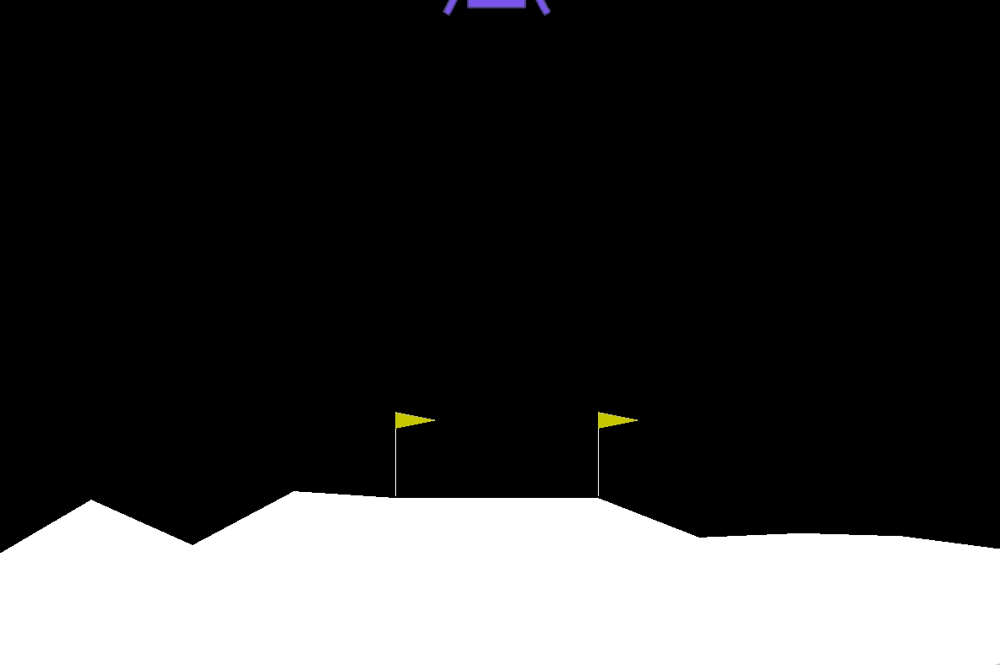
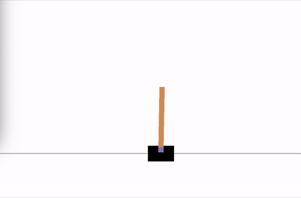
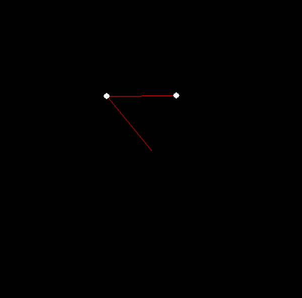

# OpenAI-Gym

Attempts at using various RL techniques to solve OpenAI gym problems for fun. The implementations are from scratch and uses either Keras or numpy in order to implement the neural nets. (For learning I implemented my own neural net module. This is obviously really ineffecient, but it was a fun experience and I wanted to make sure I had a concrete understanding of what is going on under the hood)

What I learned:
 * Implemention of Q-learning, Double Q-learning and policy gradient methods from sractch.
 * Concrete understanding of NNs by implementing my own back-propogation.
 * Using RK methods to implement a simple environment with physics.
 * Tuning RL models is hard. It is important to automate as much as possible so you're not wasting time on things which can just be random searched.

  

<i> Lunar lander using Double Q-learning</i> 

  

<i> Cart-Pole using Policy Gradient</i> 

This repo also includes an double pendulum environment I made in pygame. This came as a result of me getting stuck in an airport a few years back after I missed a flight. I had nothing on me, and I had nothing else to do, so I derived the kinematics of the double pendulum, as one does. Once I got back home I implemented it with RK4, but sadly it's probably not robust or fast enough to be used effectively for RL.

  

<i> Wheeee~</i> 

